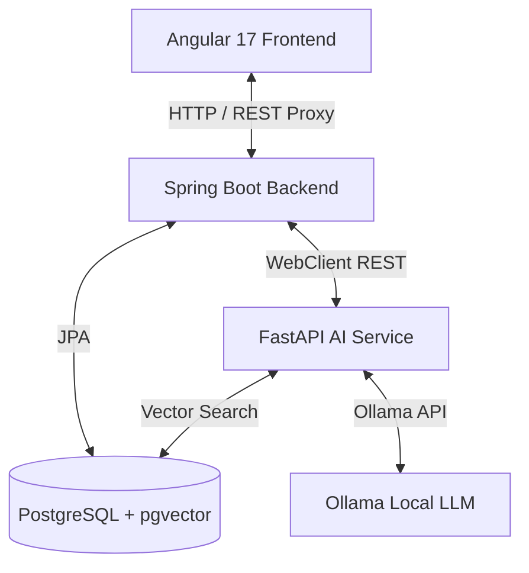
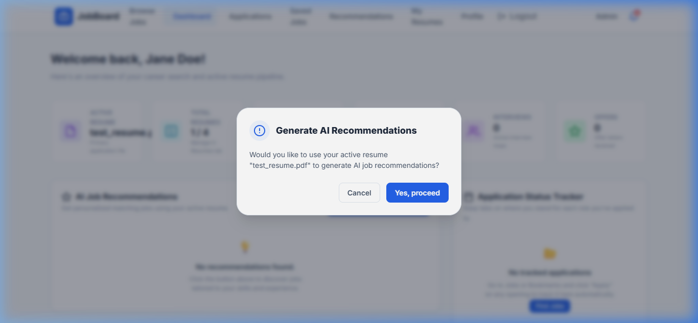
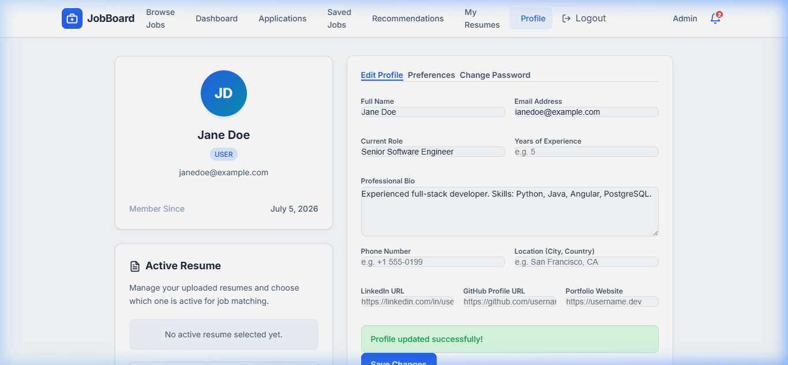
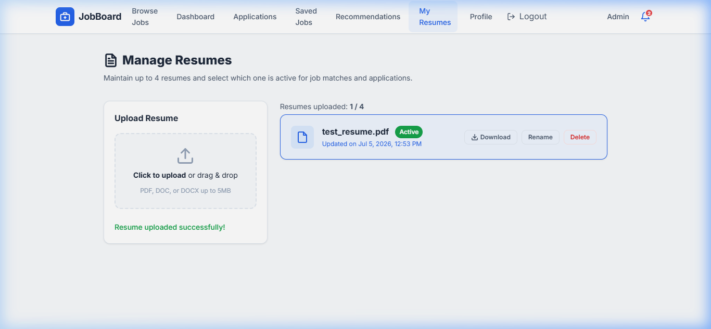
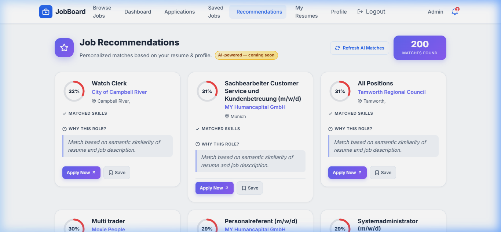
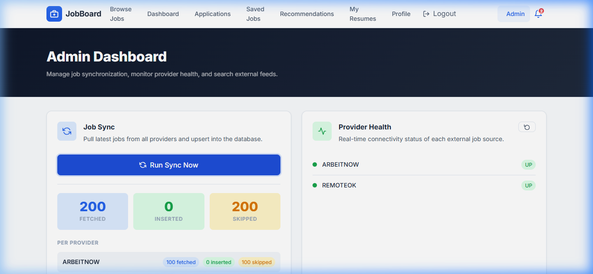

# 🚀 Job Platform

A full-stack job platform application built with **Angular 17**, **Spring Boot 3.5**, and **FastAPI AI Engine**, designed to connect job seekers with opportunities. The platform features job browsing, intelligent recommendations (utilizing vector similarity embeddings), resume management, real-time application tracking, and an admin dashboard.

---

## 📐 Architecture

This is a **monorepo** containing three independent submodules:

```
job-platform/
├── job-platform-api/    → Spring Boot REST API (Backend/Gateway)
├── job-platform-ui/     → Angular 17 SPA (Frontend)
├── fastapi-ai/          → FastAPI AI & Vector Matching (AI Engine)
└── .gitmodules          → Git submodule configuration
```

| Layer      | Technology             | Repository |
|------------|------------------------|------------|
| **Frontend** | Angular 17, TypeScript, RxJS | [job-platform-ui](https://github.com/Raghavendra-Devale/job-platform-ui) |
| **Backend**  | Spring Boot 3.5, Java 17, JPA | [job-platform-api](https://github.com/Raghavendra-Devale/job-platform-api) |
| **AI Engine**| FastAPI, sentence-transformers, pgvector, Ollama | [fastapi-ai](https://github.com/Raghavendra-Devale/fastapi-ai) |
| **Database** | PostgreSQL + pgvector  | — |



---

## 🖼️ UI Showcase & Walkthrough

Below are the key pages of the platform showing how the application and AI recommendations function:

### 1. Candidate Dashboard
The primary hub for job seekers, providing application tracking funnels, saved jobs counts, recent views, and a quick portal to request AI job recommendations.


### 2. Candidate Profile Settings
Job seekers can update their current role, biography, contact information, preferred roles, target locations, and select their technical skills to refine recommendation filters.


### 3. Resume Management & AI Processing Status
Candidates can upload up to 4 resumes. Once uploaded, the file is sent to the FastAPI AI service, which parses details (experience, education, projects, skills). The UI shows real-time processing status (`PROCESSING`, `SUCCESS`, or `FAILED`).


### 4. Intelligent AI Recommendations
Based on the candidate's active resume and profile preferences, the AI service matches skills, evaluates similarity, and outputs matched skills and a detailed explanation of why the role matches. Includes a **Refresh AI Matches** manual trigger.


### 5. Administrative Dashboard & Job Syncer
Admins can monitor external job provider health (e.g., Arbeitnow, RemoteOK) and run a manual sync to populate the relational database with live job postings.


---

## ✨ Features

### For Job Seekers
- 🔍 **Job Search & Browsing** — Filter and explore job listings
- 📄 **Resume Management** — Upload and manage multiple resumes with real-time AI status tracking
- 📋 **Application Tracking** — Track the status of all your applications (Applied, Interviewing, Offered)
- 💾 **Saved Jobs** — Bookmark jobs to apply later
- 🤖 **Smart AI Recommendations** — Get personalized job suggestions based on vector similarity between your profile/resume and job listings, with detailed explanations
- 👤 **Profile Management** — Build a comprehensive profile with skills, experience, and social links
- ⚙️ **Settings** — Manage account preferences and notifications

### For Admins
- 🛠️ **Admin Dashboard** — Manage platform content, monitor sync status, and run manual job imports

### Platform
- 🔐 **JWT Authentication** — Secure login/registration with token-based auth
- 🔔 **Real-time Notifications** — Stay updated on application status changes
- 📊 **Dashboard Analytics** — Visual overview of job-seeking activity

---

## 🛠️ Prerequisites

| Tool        | Version   | Purpose              |
|-------------|-----------|----------------------|
| **Java**    | 17+       | Backend runtime      |
| **Maven**   | 3.8+      | Backend build tool   |
| **Python**  | 3.12+     | AI Service runtime   |
| **uv**      | Latest    | Python package manager|
| **Node.js** | 18+       | Frontend runtime     |
| **npm**     | 9+        | Frontend dependencies|
| **PostgreSQL**| 14+ (with pgvector) | Database         |
| **Ollama**  | Latest    | Local LLM running llama3|

---

## ⚡ Quick Start

### Option A: Local Run (Step-by-Step)

#### 1. Clone the Repository
```bash
git clone --recurse-submodules https://github.com/Raghavendra-Devale/job-platform.git
cd job-platform
```
> If you already cloned without submodules:
> ```bash
> git submodule update --init --recursive
> ```

#### 2. Set Up the Database
Make sure PostgreSQL with the `pgvector` extension is running, then run:
```sql
CREATE DATABASE job_platform;
```

#### 3. Start the FastAPI AI Engine
1. Navigate to the folder:
   ```bash
   cd fastapi-ai
   ```
2. Pull the llama3 model locally in Ollama:
   ```bash
   ollama pull llama3
   ```
3. Install dependencies and start the server:
   ```bash
   uv sync
   uv run uvicorn app.main:app --reload --port 8000
   ```
The AI service starts on **http://localhost:8000**

#### 4. Start the Backend
```bash
cd ../job-platform-api
./mvnw spring-boot:run
```
The API will start on **http://localhost:8080**

#### 5. Start the Frontend
```bash
cd ../job-platform-ui
npm install
npm start
```
The UI will start on **http://localhost:4200**

---

### Option B: Docker Compose (All Services)

To build and run all services (Frontend, Backend, AI Engine, and PostgreSQL with pgvector) in one command:
```bash
docker compose up --build
```
Ensure Ollama is running on your host machine to handle LLM completion queries.

---

## 📖 Subproject Documentation

Each subproject has its own detailed README:

| Subproject | README |
|------------|--------|
| Backend API | [`job-platform-api/README.md`](./job-platform-api/README.md) |
| Frontend UI | [`job-platform-ui/README.md`](./job-platform-ui/README.md) |
| AI Microservice | [`fastapi-ai/README.md`](./fastapi-ai/README.md) |

---

## 🔗 API Documentation

Once the backend is running, Swagger UI is available at:
- **Spring Boot API Gateway Docs:** http://localhost:8080/swagger-ui/index.html
- **FastAPI AI Service Docs:** http://localhost:8000/docs

---

## 📂 Project Structure Overview

```
job-platform/
│
├── job-platform-api/                   # Spring Boot Backend Gateway
│   └── src/main/java/com/jobrecommendation/
│       ├── user/                       # Profile, settings, auth controllers & services
│       ├── resume/                     # PDF resume upload and status tracking
│       ├── jobs/                       # Postings aggregation and syncer triggers
│       ├── applications/               # Applied and Saved jobs tracking
│       ├── recommendation/             # Recommendations API orchestrator
│       ├── dashboard/                  # Candidate workspace statistics
│       ├── infrastructure/             # Security filters, WebClient AI Client configs
│       ├── common/                     # Global exception filters and cross-cutting helpers
│       └── JobPlatformApiApplication.java # Spring Boot entry class
│
├── job-platform-ui/                    # Angular Frontend SPA
│   └── src/app/
│       ├── core/                       # HTTP interceptors, services, route guards, models
│       ├── features/                   # Standalone pages (dashboard, resume, job, profile)
│       └── shared/                     # UI overlays, modals, bells, navbar layout
│
├── fastapi-ai/                         # FastAPI Machine Learning Engine
│   ├── app/
│   │   ├── api/                        # HTTP controllers (resume, recommendations, health)
│   │   ├── application/                # Application use-case coordinators
│   │   ├── domain/                     # Embeddings, similarity, LLM provider models
│   │   ├── core/                       # Settings validation & middleware hooks
│   │   └── main.py                     # Uvicorn entry point
│
├── .gitmodules                         # Submodule references
└── README.md                          # Monorepo README
```

---

## 🧰 Tech Stack

### Backend
- **Spring Boot 3.5** — Application framework
- **Spring Data JPA** — Database ORM
- **Spring Security** — Authentication & authorization
- **Auth0 java-jwt** — JWT token generation/validation
- **jBCrypt** — Password hashing
- **Lombok** — Boilerplate reduction
- **SpringDoc OpenAPI** — Swagger API documentation
- **Spring Boot Actuator** — Health & monitoring endpoints
- **PostgreSQL** — Relational database

### Frontend
- **Angular 17** — Component framework with standalone components
- **TypeScript 5.4** — Type-safe JavaScript
- **RxJS 7.8** — Reactive programming
- **Angular Router** — Client-side routing with lazy loading & view transitions
- **Angular Animations** — UI transitions and micro-interactions

### AI Engine
- **FastAPI** — Python web framework
- **sentence-transformers** — Sentence-level text embeddings (`all-MiniLM-L6-v2`)
- **pgvector** — Vector databases extension
- **Ollama** — Generative AI local integrations

---

## 🤝 Contributing

1. Fork the repository
2. Create a feature branch (`git checkout -b feature/amazing-feature`)
3. Commit your changes (`git commit -m 'Add amazing feature'`)
4. Push to the branch (`git push origin feature/amazing-feature`)
5. Open a Pull Request

---

## 📝 License

This project is for learning and portfolio purposes.

---

<p align="center">
  Built with ❤️ by <a href="https://github.com/Raghavendra-Devale">Raghavendra Devale</a>
</p>
