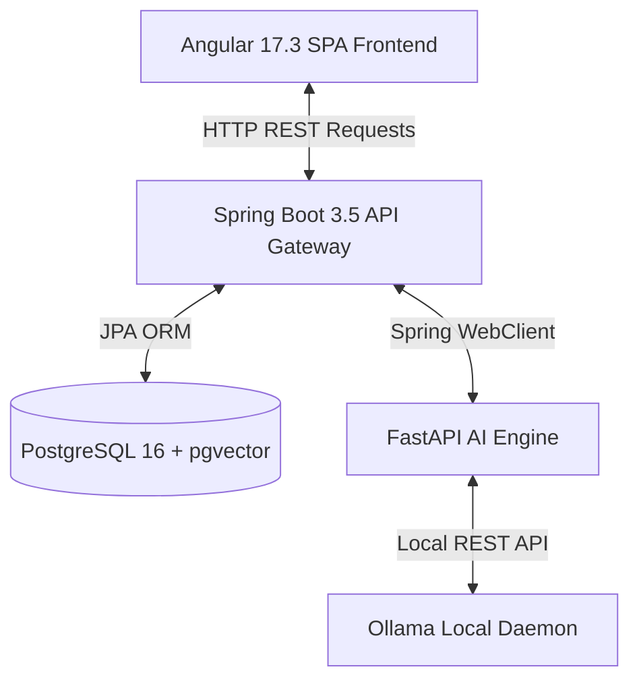
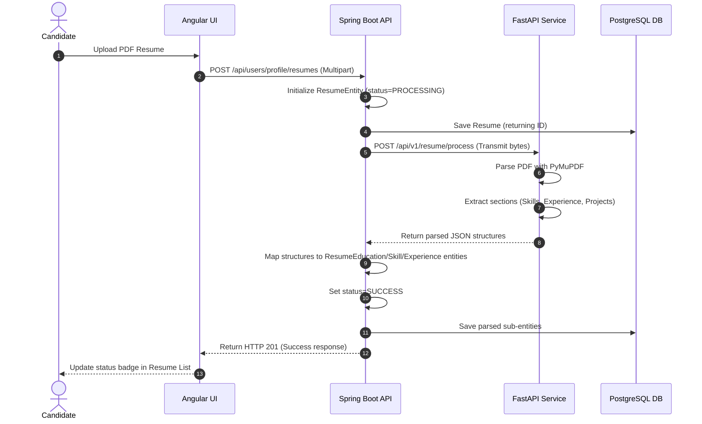
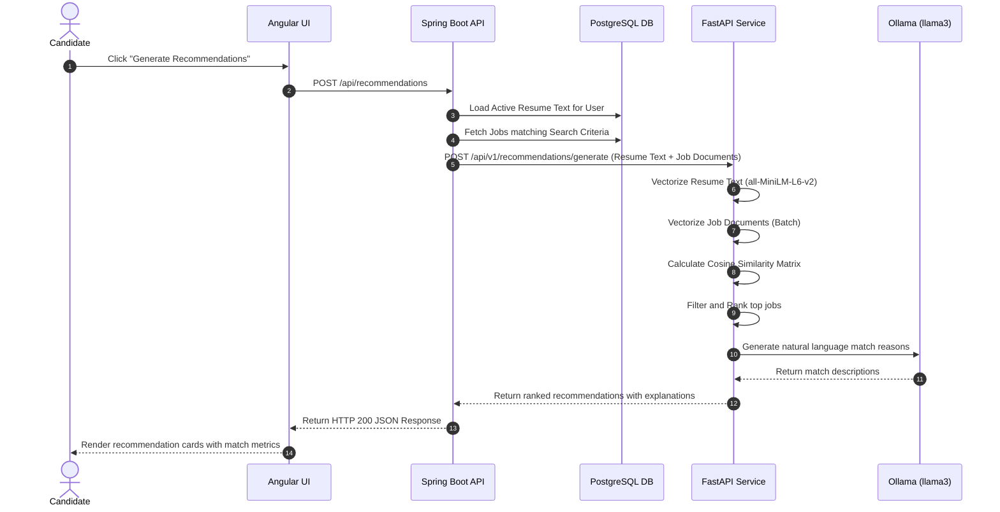

# System Architecture Documentation

This document describes the architectural design, business domains, module responsibilities, and request flows of the Job Platform.

---

## 🎯 1. Vision & Architecture Goals

The Job Platform is an AI-powered job discovery application designed to match candidate resumes with job postings using vector similarity embeddings.

Key goals of the architecture:
- **Feature-First Organization:** Modules are structured around cohesive business capabilities rather than technical layers.
- **Unidirectional Dependency Flow:** Code dependencies flow in one direction to prevent circular references.
- **AI as Infrastructure:** The machine learning service is treated as an replaceable external utility. The business logic resides within the core backend.
- **Stateless API Gateway:** Secure endpoints are exposed through a Spring Boot gateway mapping to stateless sessions authenticated via JSON Web Tokens (JWT).

---

## 🎨 2. Architectural Design Principles

1. **Strict Component Isolation:** Business modules must own their respective domain logic, JPA entities, and data storage.
2. **Interface-Driven Integration:** Modules communicate with external infrastructure layers (like the FastAPI AI client) via well-defined interface contracts.
3. **No Cross-Domain entity pollution:** Cross-module references are managed via database IDs or dedicated DTOs rather than direct JPA model coupling.
4. **Thin Controller Layer:** Controllers validate payloads and delegate execution immediately to transactional Application Services.

---

## 🏗️ 3. High-Level System Topology

The platform is configured as a monorepo consisting of three decoupled sub-systems:



### Module Responsibilities

| Sub-System | Primary Technologies | Responsibilities |
|------------|----------------------|------------------|
| **`job-platform-ui`** | Angular 17.3, RxJS, TypeScript | Standalone features SPA, client-side route guarding, visual dashboards. |
| **`job-platform-api`**| Spring Boot 3.5, Java 17, JPA | Authentication filter, JPA database operations, schedules syncer, AI REST Client. |
| **`fastapi-ai`** | FastAPI, PyMuPDF, sentence-transformers | Parse PDF resumes, calculate cosine similarity scores, run llama3 completions. |

---

## 📦 4. Backend Code Layout (`com.jobrecommendation`)

The backend codebase is organized by business feature package inside `src/main/java/com/jobrecommendation/`:

```
com.jobrecommendation/
│
├── JobPlatformApiApplication.java      # Boot class
│
├── user/                               # User Management
│   ├── api/                            # Controllers (UserController, AuthController)
│   ├── application/                    # UserService, ActivityService
│   └── domain/                         # UserEntity, UserProfileEntity, UserRepository
│
├── resume/                             # Resume Processor
│   ├── api/                            # ResumeController
│   ├── application/                    # ResumeService, ResumeQueryService
│   └── domain/                         # ResumeEntity, ResumeSkillEntity, repository/
│
├── jobs/                               # Job Aggregator
│   ├── api/                            # JobController
│   ├── application/                    # JobService, JobSyncService
│   └── domain/                         # JobEntity, JobSyncHistoryEntity, repository/
│
├── applications/                       # Application Trackers
│   ├── api/                            # (Integrated in DashboardController)
│   ├── application/                    # ApplicationService
│   └── domain/                         # JobApplicationEntity, SavedJobEntity
│
├── recommendation/                     # AI Matchmakers
│   ├── api/                            # RecommendationController
│   └── application/                    # RecommendationOrchestrator
│
├── dashboard/                          # Statistics Analytics
│   ├── api/                            # DashboardController
│   └── application/                    # Dashboard orchestration
│
├── infrastructure/                     # Technical Integrations
│   ├── ai/                             # WebClient REST implementation of RecommendationAiClient
│   └── security/                       # SecurityConfig, JwtService, JwtAuthenticationFilter
│
└── common/                             # Cross-Cutting Shared utilities
    ├── GlobalExceptionHandler.java     # Rest Exception Advices
    └── dto/                            # General Shared DTO structures
```

---

## 🔄 5. Key Request Flows

### A. Resume Processing Sequence

When a candidate uploads a PDF resume, the file is parsed by the AI service and saved into structured tables:



### B. Recommendations Generation Sequence

Job matches are computed dynamically using vector embeddings generated by the Sentence-Transformer model:



---

## 📝 6. Architecture Decision Log

| Date | Decision | Rationale | Status |
|------|----------|-----------|--------|
| **2026-07** | Feature-First Package Refactoring | Group packages by business domain (`user`, `resume`, `jobs`) instead of layers (`controller`, `service`, `entity`) to improve modular maintainability. | **Implemented** |
| **2026-07** | dynamic Vector Recommendations | Shift embedding vector similarity calculations to the FastAPI microservice to offload CPU-intensive transformer tasks from the Java API gateway. | **Implemented** |
| **2026-07** | Local Generative Explanations | Integrate local Ollama (Llama 3) daemon to dynamically describe why job listings align with resume experiences. | **Implemented** |
| **2026-07** | Database pgvector Migration | Postpone DB-level pgvector HNSW calculations until database sizes exceed 50k listings. Keep dynamic in-memory matching for early project phases. | **Postponed** |
