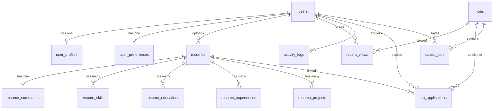

# Database Schema Documentation

This document describes the database schema used by the Job Platform.

The platform uses a relational **PostgreSQL** database (version 16) with the `pgvector` extension enabled in the Docker container image. Schema generation is managed automatically by Hibernate (`ddl-auto=update`).

---

## 🗺️ Entity Relationship Overview

The diagram below represents the core logical structure of the database tables and their relationships:

---

## 🗃️ Table Definitions

### 1. `users`
Represents the core user credentials and authentication profiles.

| Column | Type | Constraints | Description |
|--------|------|-------------|-------------|
| `id` | `bigint` | `PRIMARY KEY`, `GENERATED BY DEFAULT AS IDENTITY` | Unique internal identifier. |
| `name` | `varchar(255)` | `NOT NULL` | The full name of the user. |
| `email` | `varchar(255)` | `NOT NULL`, `UNIQUE` | User login email. Index: `idx_users_email` |
| `password` | `varchar(255)` | `NOT NULL` | BCrypt-hashed password. |
| `role` | `varchar(255)` | `NOT NULL` | Role for Authorization: `USER`, `ADMIN`. |
| `work_preference` | `varchar(255)` | Default: `'ANY'` | Preferred workplace type: `REMOTE`, `ONSITE`, `HYBRID`, `ANY`. |
| `alert_enabled` | `boolean` | Default: `true` | Opt-in flag for job email notifications. |
| `experience` | `integer` | | Years of experience (Deprecated - migrating to `user_profiles`). |
| `current_role_title` | `varchar(255)`| | Title of current job role (Deprecated - migrating to `user_profiles`). |
| `bio` | `text` | | Candidate summary (Deprecated - migrating to `user_profiles`). |
| `linkedin` | `varchar(255)` | | LinkedIn link (Deprecated - migrating to `user_profiles`). |
| `github` | `varchar(255)` | | GitHub profile link (Deprecated - migrating to `user_profiles`). |
| `portfolio` | `varchar(255)` | | Portfolio URL (Deprecated - migrating to `user_profiles`). |
| `preferred_roles` | `varchar(255)`| | List of target role titles (Deprecated - migrating to `user_preferences`). |
| `preferred_locations` | `varchar(255)`| | List of target job locations (Deprecated - migrating to `user_preferences`). |
| `remote_only` | `boolean` | | Filter remote jobs only (Deprecated - migrating to `user_preferences`). |
| `salary_range` | `varchar(255)`| | Desired salary bracket (Deprecated - migrating to `user_preferences`). |
| `job_types` | `varchar(255)`| | Desired employment types (Deprecated - migrating to `user_preferences`). |
| `created_at` | `timestamp` | `NOT NULL` | Account creation date. |

### 2. `user_profiles`
Holds additional profile metadata for the candidate.

| Column | Type | Constraints | Description |
|--------|------|-------------|-------------|
| `id` | `bigint` | `PRIMARY KEY`, `GENERATED BY DEFAULT AS IDENTITY` | Unique internal identifier. |
| `user_id` | `bigint` | `FOREIGN KEY` references `users(id)`, `NOT NULL`, `UNIQUE` | Links to the user. |
| `name` | `varchar(255)` | | Full candidate name. |
| `phone` | `varchar(255)` | | Contact number. |
| `location` | `varchar(255)` | | Geographical location. |
| `current_role_title` | `varchar(255)`| | Job title of current position. |
| `experience` | `integer` | | Years of professional experience. |
| `bio` | `text` | | Professional summary description. |
| `linkedin` | `varchar(255)` | | LinkedIn profile link. |
| `github` | `varchar(255)` | | GitHub profile link. |
| `portfolio` | `varchar(255)` | | Portfolio website URL. |

### 3. `user_preferences`
Contains target job searching criteria for the user.

| Column | Type | Constraints | Description |
|--------|------|-------------|-------------|
| `id` | `bigint` | `PRIMARY KEY`, `GENERATED BY DEFAULT AS IDENTITY` | Unique internal identifier. |
| `user_id` | `bigint` | `FOREIGN KEY` references `users(id)`, `NOT NULL`, `UNIQUE` | Links to the user. |
| `preferred_roles` | `varchar(255)`| | Comma-separated target roles. |
| `preferred_locations` | `varchar(255)`| | Comma-separated target locations. |
| `remote_only` | `boolean` | | True if candidate only wants remote jobs. |
| `salary_range` | `varchar(255)`| | Preferred compensation range. |
| `job_types` | `varchar(255)`| | Comma-separated desired job types. |

### 4. `resumes`
Stores uploaded resume files and their parsing execution states.

| Column | Type | Constraints | Description |
|--------|------|-------------|-------------|
| `id` | `bigint` | `PRIMARY KEY`, `GENERATED BY DEFAULT AS IDENTITY` | Unique internal identifier. |
| `user_id` | `bigint` | `FOREIGN KEY` references `users(id)`, `NOT NULL` | Candidate who uploaded this resume. |
| `resume_name` | `varchar(255)` | `NOT NULL` | Filename of the uploaded document. |
| `resume_data` | `bytea` | `NOT NULL` | Raw PDF binary blob. |
| `is_active` | `boolean` | `NOT NULL` | True if this is the active resume used for matching. |
| `ai_processing_status` | `varchar(255)`| `NOT NULL` | AI status: `PENDING`, `PROCESSING`, `SUCCESS`, `FAILED`. |
| `updated_at` | `timestamp` | `NOT NULL` | Last modified timestamp. |

### 5. `resume_summaries`
Stores parsed overall biography extracted from active resumes.

| Column | Type | Constraints | Description |
|--------|------|-------------|-------------|
| `id` | `bigint` | `PRIMARY KEY`, `GENERATED BY DEFAULT AS IDENTITY` | Unique internal identifier. |
| `resume_id` | `bigint` | `FOREIGN KEY` references `resumes(id)`, `NOT NULL`, `UNIQUE` | Links to the resume. |
| `summary` | `text` | `NOT NULL` | Parsed markdown or plain-text summary content. |

### 6. `resume_skills`
Normalized parsed list of technical and soft skills.

| Column | Type | Constraints | Description |
|--------|------|-------------|-------------|
| `id` | `bigint` | `PRIMARY KEY`, `GENERATED BY DEFAULT AS IDENTITY` | Unique internal identifier. |
| `resume_id` | `bigint` | `FOREIGN KEY` references `resumes(id)`, `NOT NULL` | Links to the parent resume. |
| `name` | `varchar(255)` | `NOT NULL` | Name of the skill (e.g., "Java"). |
| `rating` | `integer` | `NOT NULL` | Rated confidence score (1 to 5) determined by LLM parser. |

### 7. `resume_experiences`
Normalized parsed work history entries.

| Column | Type | Constraints | Description |
|--------|------|-------------|-------------|
| `id` | `bigint` | `PRIMARY KEY`, `GENERATED BY DEFAULT AS IDENTITY` | Unique internal identifier. |
| `resume_id` | `bigint` | `FOREIGN KEY` references `resumes(id)`, `NOT NULL` | Links to parent resume. |
| `role` | `varchar(255)` | `NOT NULL` | Job role title. |
| `company` | `varchar(255)` | `NOT NULL` | Company name. |
| `dates` | `varchar(255)` | | Dates of tenure (e.g. "2022 - Present"). |
| `responsibilities` | `text` | | Key job responsibilities and highlights. |

### 8. `resume_educations`
Normalized parsed education items.

| Column | Type | Constraints | Description |
|--------|------|-------------|-------------|
| `id` | `bigint` | `PRIMARY KEY`, `GENERATED BY DEFAULT AS IDENTITY` | Unique internal identifier. |
| `resume_id` | `bigint` | `FOREIGN KEY` references `resumes(id)`, `NOT NULL` | Links to parent resume. |
| `degree` | `varchar(255)` | `NOT NULL` | Degree earned (e.g. "B.S. Computer Science"). |
| `school` | `varchar(255)` | `NOT NULL` | University or school name. |
| `dates` | `varchar(255)` | | Dates attended. |

### 9. `resume_projects`
Normalized parsed personal and professional project history.

| Column | Type | Constraints | Description |
|--------|------|-------------|-------------|
| `id` | `bigint` | `PRIMARY KEY`, `GENERATED BY DEFAULT AS IDENTITY` | Unique internal identifier. |
| `resume_id` | `bigint` | `FOREIGN KEY` references `resumes(id)`, `NOT NULL` | Links to parent resume. |
| `name` | `varchar(255)` | `NOT NULL` | Project name. |
| `description` | `text` | | Project summary. |
| `tech_stack` | `varchar(255)`| | Comma-separated technologies used. |

### 10. `jobs`
Main index table storing aggregated job listings.

| Column | Type | Constraints | Description |
|--------|------|-------------|-------------|
| `id` | `bigint` | `PRIMARY KEY`, `GENERATED BY DEFAULT AS IDENTITY` | Unique internal identifier. |
| `external_job_id` | `varchar(255)`| | Unique ID from provider (e.g., Arbeitnow). |
| `title` | `varchar(255)` | | Job title. Index: `idx_jobs_title` |
| `company` | `varchar(255)` | | Company name. Index: `idx_jobs_company` |
| `location` | `varchar(255)` | | Job location. Index: `idx_jobs_location` |
| `description` | `text` | | HTML or plain-text job description body. |
| `apply_url` | `varchar(255)` | | Direct application link. |
| `salary` | `varchar(255)` | | Compensation string description. |
| `job_type` | `varchar(255)` | | Employment type (e.g. "Full-time"). |
| `source` | `varchar(255)` | | Source platform name. Index: `idx_jobs_source` |
| `remote` | `boolean` | | True if job has remote flexibility. |
| `tags` | `text` | | Comma-separated metadata tags. |
| `created_at` | `timestamp` | | Date the job posting was created. |
| `salary_min` | `integer` | | Minimum parsed bounds of salary. |
| `salary_max` | `integer` | | Maximum parsed bounds of salary. |
| `currency` | `varchar(255)` | | Currency type. |
| `last_seen_at` | `timestamp` | | Last time syncer verified job existence. |
| `active` | `boolean` | | Active status (false if deleted/expired). |
| `provider` | `varchar(255)` | | Syncer provider namespace. |
| `provider_url` | `varchar(255)` | | Syncer provider domain link. |
| `provider_job_id` | `varchar(255)`| | Syncer local ID. |
| *Constraints:* | | `UNIQUE(source, external_job_id)` | Prevents duplicate imports from the same provider. |

### 11. `job_applications`
Core tracking system mapping users to applications.

| Column | Type | Constraints | Description |
|--------|------|-------------|-------------|
| `id` | `bigint` | `PRIMARY KEY`, `GENERATED BY DEFAULT AS IDENTITY` | Unique internal identifier. |
| `user_id` | `bigint` | `FOREIGN KEY` references `users(id)`, `NOT NULL` | The applicant candidate. |
| `job_id` | `bigint` | `FOREIGN KEY` references `jobs(id)`, `NOT NULL` | The target job. |
| `resume_id` | `bigint` | `FOREIGN KEY` references `resumes(id)` | Resume document attached to this application. |
| `status` | `varchar(255)` | `NOT NULL` | Tracking state: `APPLIED`, `SCREENING`, `INTERVIEW`, `OFFER`, `REJECTED`. |
| `applied_at` | `timestamp` | `NOT NULL` | Application date. |
| `updated_at` | `timestamp` | | Timestamp of the latest status transition. |

### 12. `saved_jobs`
Enables bookmarking job listings.

| Column | Type | Constraints | Description |
|--------|------|-------------|-------------|
| `id` | `bigint` | `PRIMARY KEY`, `GENERATED BY DEFAULT AS IDENTITY` | Unique internal identifier. |
| `user_id` | `bigint` | `FOREIGN KEY` references `users(id)`, `NOT NULL` | The bookmarker. |
| `job_id` | `bigint` | `FOREIGN KEY` references `jobs(id)`, `NOT NULL` | The saved job. |
| `saved_at` | `timestamp` | `NOT NULL` | Bookmarking date. |
| *Constraints:* | | `UNIQUE(user_id, job_id)` | Prevents bookmarking the same job twice. |

### 13. `recent_views`
Maintains a sliding history of recently viewed job descriptions.

| Column | Type | Constraints | Description |
|--------|------|-------------|-------------|
| `id` | `bigint` | `PRIMARY KEY`, `GENERATED BY DEFAULT AS IDENTITY` | Unique internal identifier. |
| `user_id` | `bigint` | `FOREIGN KEY` references `users(id)`, `NOT NULL` | User browsing details. |
| `job_id` | `bigint` | `FOREIGN KEY` references `jobs(id)`, `NOT NULL` | Job description page viewed. |
| `viewed_at` | `timestamp` | `NOT NULL` | Last viewed timestamp. |
| *Constraints:* | | `UNIQUE(user_id, job_id)` | Enforces unique row per user-job pairs. |

### 14. `activity_logs`
Chronological user audit trail.

| Column | Type | Constraints | Description |
|--------|------|-------------|-------------|
| `id` | `bigint` | `PRIMARY KEY`, `GENERATED BY DEFAULT AS IDENTITY` | Unique internal identifier. |
| `user_id` | `bigint` | `FOREIGN KEY` references `users(id)`, `NOT NULL` | The actor. |
| `activity_type` | `varchar(255)`| `NOT NULL` | Category: `JOB_SAVED`, `APPLICATION_SUBMITTED`, etc. |
| `description` | `varchar(255)`| `NOT NULL` | Informative text action description. |
| `created_at` | `timestamp` | `NOT NULL` | Logging date. |

### 15. `job_sync_history`
Maintains job importer diagnostics.

| Column | Type | Constraints | Description |
|--------|------|-------------|-------------|
| `id` | `bigint` | `PRIMARY KEY`, `GENERATED BY DEFAULT AS IDENTITY` | Unique internal identifier. |
| `sync_time` | `timestamp` | `NOT NULL` | Execution date. |
| `jobs_processed`| `integer` | `NOT NULL` | Count of records analyzed from external feeds. |
| `jobs_imported` | `integer` | `NOT NULL` | Count of new rows added to the `jobs` database. |
| `status` | `varchar(255)` | `NOT NULL` | Job sync status: `SUCCESS`, `FAILURE`. |
| `message` | `varchar(255)`| | Logs warnings or traceback failure reasons. |

---

## 🧠 AI Vector & pgvector Configurations

Although `pgvector/pgvector:pg16` is standard in the PostgreSQL database container (`postgres` service in `compose.yaml`), **vector embeddings are not stored directly in Postgres tables in the current project phase**.

### Match-making Embeddings Execution Model
1. **Dynamic Generation:** When recommendations are triggered, the active resume text and target jobs are loaded by `job-platform-api` and forwarded via REST API to the `fastapi-ai` service.
2. **In-Memory Score Computation:** `fastapi-ai` generates embeddings for resume and job texts using `all-MiniLM-L6-v2` (`sentence-transformers`), calculates cosine similarity scores in memory using NumPy/PyTorch, and ranks recommendations.
3. **Future Extension:** The infrastructure is prepared to persist embeddings into `resumes` and `jobs` tables using PostgreSQL's `pgvector` column types (`vector(384)`) for index-based DB search scaling, which is planned for upcoming milestones.
