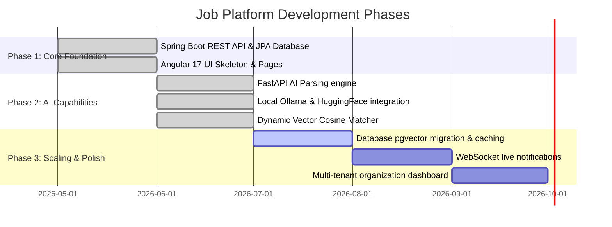

# Project Roadmap

This document outlines the current achievements and milestones of the Job Platform, as well as planned enhancements for future development cycles.

---

## 📅 Milestones & Feature Board

---

## 🏆 Current Achievements (Version 1.0)

The following components and features have been fully implemented, validated, and integrated:

### 1. Security & Authentication
- **HttpOnly Cookies Session Security:** JWT token generation and storage via secure, HttpOnly, SameSite strict cookies protecting users from XSS attacks.
- **Spring Security Filters:** Custom filters extracting and validating bearer tokens, defining public API gateways and protected resource routes.

### 2. User & Candidate Workspace
- **Profile Customizer:** Candidate configuration settings specifying contact metrics, resume uploads, social links, location, and bio.
- **Preference Engine:** Flexible target criteria settings (salary bracket, desired roles, remote flexibility, employment types) filtering recommendations.
- **Activity Log & Views:** Audits user activities (e.g., job bookmarking, resume processing) and maintains a sliding history of the 10 most recently viewed jobs.

### 3. Asynchronous AI Resume Intelligence
- **FastAPI Document Extractor:** Parses uploaded PDF binary bytes using PyMuPDF (`fitz`), clean-normalizes raw text, and employs structured parsing pipelines.
- **Entity Extraction Mapping:** Structural classification of resumes into summaries, technical skills (with confidence ratings), work history, educations, certifications, and languages.
- **Real-time Status Badging:** Multi-state workflow indicator displaying resume upload status (`PENDING`, `PROCESSING`, `SUCCESS`, `FAILED`) on the UI.

### 4. Semantic Matchmaking Recommendation Engine
- **Local Embedding Vectorizer:** Generates dense vector representations of parsed resume data and job documents using the `all-MiniLM-L6-v2` Sentence-Transformer model.
- **Cosine Similarity Matcher:** Computes similarity matrix rankings in-memory, aligning candidate profiles against available database job listings.
- **Generative Match Explanations:** Employs a local **Ollama** LLM interface (running `llama3`) to construct natural-language explanations of why each job is recommended.

### 5. Automated Job Syncer
- **External Feeds Processing:** Abstracted `JobProvider` structures fetching listings from third-party services (e.g., Arbeitnow, RemoteOK).
- **Scheduled Admin Scheduler:** Automatic scheduled processes and manual admin triggers importing new postings into the database while avoiding duplicate entries.

---

## 🔮 Future Backlog & Architectural Decisions

The following items are deferred for upcoming development cycles to ensure architecture stability:

### 1. Database-Level Vector Query Scaling
- **Problem:** Currently, vector similarity matches are calculated dynamically in-memory on the FastAPI side. This does not scale if the database contains hundreds of thousands of job listings.
- **Solution:** Migrate to database-level vector indexing. Store generated embeddings directly in the `jobs` and `resumes` tables using PostgreSQL's `pgvector` column types (`vector(384)`). Execute similarity searches using SQL queries with HNSW (Hierarchical Navigable Small World) indices.

### 2. Live Notifications Pipeline
- **Problem:** Resume parsing status transitions require manual page refreshes or HTTP polling.
- **Solution:** Establish a duplex WebSocket connection using Spring WebSockets/STOMP or Server-Sent Events (SSE) to push status updates from backend worker queues to the UI immediately.

### 3. Extended File Parsing Formats
- **Problem:** Resume uploads are currently restricted to PDF files.
- **Solution:** Add docx and text content parsers using Python libraries (e.g. `python-docx`) to support a wider array of document formats.

### 4. Smart Email Alerts
- **Problem:** Users must log in manually to see new matching recommendations.
- **Solution:** Configure a Spring Boot Mail sender scheduler comparing newly synced jobs with active user preferences and sending daily emails of top matches.

### 5. Payment & Premium Job Postings
- **Problem:** No monetization vectors exist for employers posting jobs.
- **Solution:** Integrate Stripe billing gateways to charge recruiting organizations for listing premium jobs.
